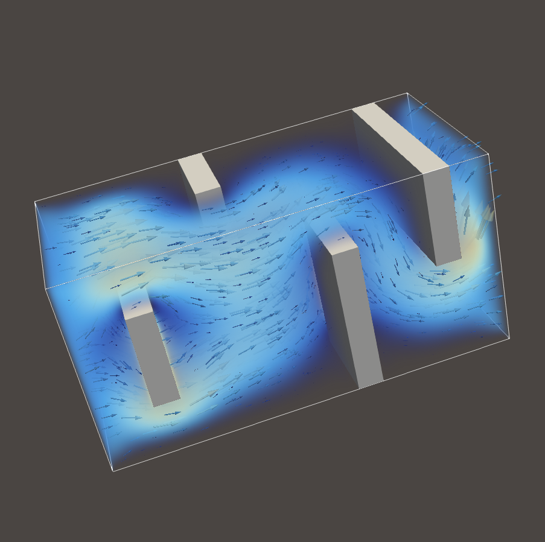
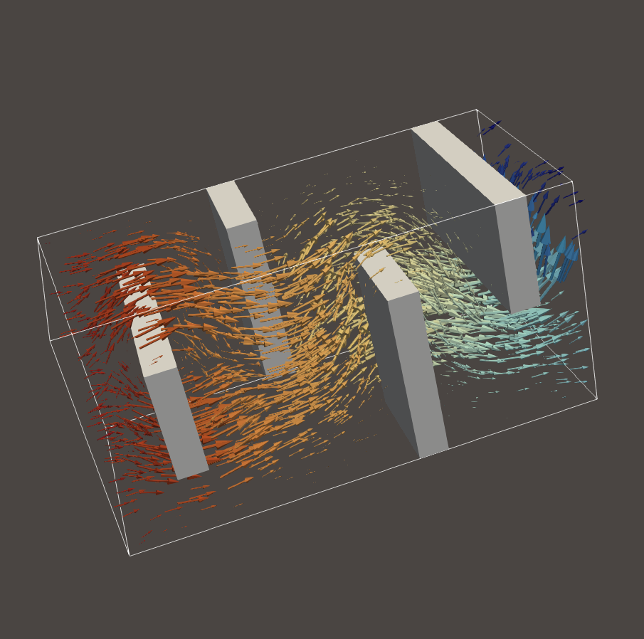
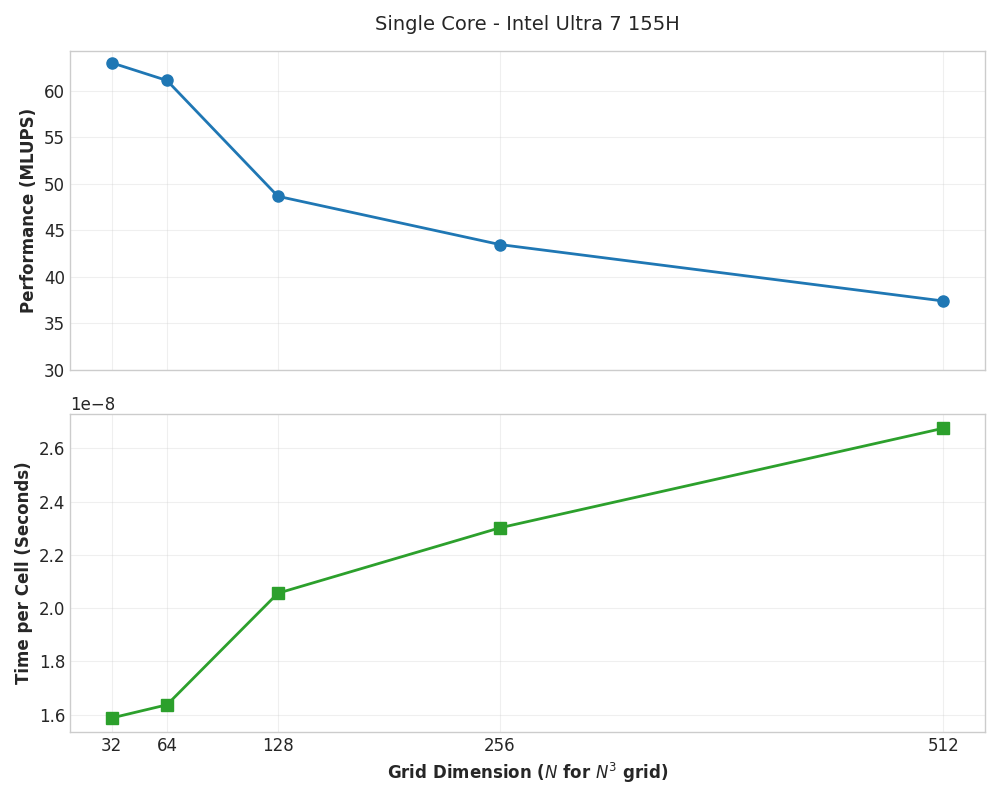

# Stokes-Brinkman finite-difference ADI solver

## Gallery

|  |   |
|:--------:|:-------:|
| Velocity field magnitude | Pressure colored velocity field |

## Performance

Currently running in **single-core** on Intel Ultra 7 155H (2023).

## TODO

- [x] complete fused Dxx rhs computation
- [ ] add support for floats in fused Dxx rhs computation
- [ ] fuse pressure update into Dzz solve
- [ ] complete fused pressure solve
- [x] test with obstacles using low permeability
- [ ] convergence test with variable permeability
- [ ] parallelize kernels across cores (pthreads/openmp)
- [ ] implement schur complement
- [ ] parallelize schur complement across nodes (MPI)
- [ ] outflow boundary conditions
- [ ] benchmark AUTO_VEC performance
